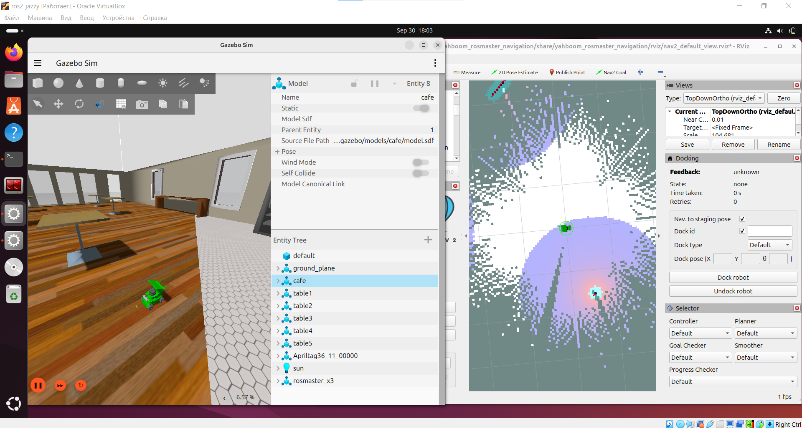

## Проект: Настройка ROS2 проекта для четырехколесной мобильной платформы на mecanum колесах (yahboom rosmaster)

Данный проект посвящён настройке **ROS 2** системы для управления мобильной робототехнической платформы на Mecanum wheels, за основу взять существующий Yahboom Rosmaster x3. Ключевой задачей является реализация омни-движения, объединение сенсорных данных (одометрия, IMU, лидар) через **EKF** и обеспечение автономной навигации посредством алгоритмов **SLAM** через библиотеку Navigation2.

Ниже представлен анализ кинематики движения робота, основные компоненты системы, структура ROS проекта и инструкция к запуску. 

---

## 1. Система координат и определние параметров

### 1.1. Система координат и нумерация колёс
Система координат (`base_frame`) ROS 2.
* **X**: Направление вперёд (положительное).
* **Y**: Направление влево (положительное).
* **$\omega_z$**: Вращение против часовой стрелки (положительное).

**Определение колес**:
| Номер | Обозначение | Описание |
| :---: | :---: | :--- |
| **1** | $\theta_1$ | **FL** (Front-Left / Переднее левое) |
| **2** | $\theta_2$ | **FR** (Front-Right / Переднее правое) |
| **3** | $\theta_3$ | **RL** (Rear-Left / Заднее левое) |
| **4** | $\theta_4$ | **RR** (Rear-Right / Заднее правое) |

### 1.2. Определения условных обозначений
| Условное обозначение | Описание | Единица Измерения |
| :---: | :--- | :---: |
| $\mathbf{R}$ | Радиус каждого колеса | метры |
| $\mathbf{L}$ | Расстояние от центра робота до оси колеса по оси X | метры |
| $\mathbf{W}$ | Расстояние от центра робота до оси колеса по оси Y | метры |
| $\mathbf{v_x}$ | Линейная скорость робота по оси X | м/с |
| $\mathbf{v_y}$ | Линейная скорость робота по оси Y | м/с |
| $\mathbf{\theta_z}$ | Угловая скорость робота вокруг центра | рад/с |
| $\mathbf{\theta_i}$ | Угловые скорости колёс 1–4 | рад/с |

---

## 2. Кинематика mecanum колес

### 2.1. Прямая задача кинематики (Forward Kinematics)

Прямая кинематика используется для оценки движения робота на основе измеренных угловых скоростей колёс (данные энкодеров). Результат выражается в виде линейных и угловой скоростей и публикуется в сообщении `Twist`.

#### Уравнения прямой задачи кинематики

$$
\mathbf{V} = \begin{pmatrix} v_x \\ v_y \\ \theta_z \end{pmatrix}
$$

$$
v_x = \frac{R}{4} \cdot (\theta_1 + \theta_2 + \theta_3 + \theta_4) \quad \text{}
$$

$$
v_y = \frac{R}{4} \cdot (-\theta_1 + \theta_2 + \theta_3 - \theta_4) \quad \text{}
$$

$$
\theta_z = \frac{R}{4(L+W)} \cdot (-\theta_1 + \theta_2 - \theta_3 + \theta_4) \quad \text{}
$$

* $\theta_1, \theta_2, \theta_3, \theta_4$: Угловые скорости колёс (рад/с).
* $v_x$ (`linear.x`): Скорость вдоль оси X (м/с).
* $v_y$ (`linear.y`): Скорость вдоль оси Y (м/с).
* $\theta_z$ (`angular.z`): Угловая скорость (рад/с).

### 2.2. Обратная задача кинематика (Inverse Kinematics)

Обратная кинематика вычисляет угловые скорости каждого колеса ($\mathbf{\theta_i}$), требуемые для достижения желаемой скорости робота ($\mathbf{v_x}, \mathbf{v_y}, \mathbf{\theta_z}$), поступающей через топик `/cmd_vel`.

#### Уравнения обратной задачи кинематики

$$
\mathbf{\Theta} = \begin{pmatrix} \theta_1 \\ \theta_2 \\ \theta_3 \\ \theta_4 \end{pmatrix}
$$

$$
\theta_1 = \frac{1}{R} \cdot (v_x - v_y - \theta_z(L+W)) \quad \text{}
$$

$$
\theta_2 = \frac{1}{R} \cdot (v_x + v_y + \theta_z(L+W)) \quad \text{}
$$

$$
\theta_3 = \frac{1}{R} \cdot (v_x + v_y - \theta_z(L+W)) \quad \text{}
$$

$$
\theta_4 = \frac{1}{R} \cdot (v_x - v_y + \theta_z(L+W)) \quad \text{}
$$

Эти уравнения используются в контроллере движения ROS 2 для трансформации команд скорости в фактическое движение колёс.

---

## 3. Интеграция в ROS 2 прямой и обратной кинематики

## 3.1. Прямая кинематика (Одометрия)

**Прямая кинематика** вычисляет движение робота на основе угловых скоростей колёс. Эти скорости публикуются в сообщении `Twist` как линейные и угловые скорости.

#### Уравнения

### Перевод скоростей колес для публикации в Twist
* linear.x = R/4 * (front_left_wheel + front_right_wheel + back_left_wheel + back_right_wheel)
* linear.y = R/4 * (- front_left_wheel + front_right_wheel + back_left_wheel - back_right_wheel)
* angular.z = R/(4 * (L+W)) * (- front_left_wheel + front_right_wheel - back_left_wheel + back_right_wheel)

**Определения переменных:**
* **R (метры)**: Радиус колёс.
* **L (метры)**: Расстояние от центра робота до каждого колеса вдоль передней оси (X).
* **W (метры)**: Расстояние от центра робота до каждого колеса вдоль боковой оси (Y).
* **front_left_wheel, front_right_wheel, back_left_wheel, back_right_wheel (рад/с)**: Угловые скорости колёс.
* **linear.x (м/с)**: Скорость робота вдоль передней оси (X).
* **linear.y (м/с)**: Скорость робота вдоль боковой оси (Y).
* **angular.z (рад/с)**: Вращательная скорость робота вокруг его центра (против часовой стрелки — положительная).

Эти уравнения оценивают движение робота на основе обратной связи с энкодеров колёс, предоставляя одометрию в виде линейных и угловых скоростей в метрах в секунду и радианах в секунду.

---

## 3.2. Обратная кинематика (управление приводами)

**Обратная кинематика** вычисляет угловые скорости каждого колеса, необходимые для достижения желаемого движения робота, которое обычно отправляется через топик `/cmd_vel`.

#### Уравнения

* Front_left_wheel = 1/R * (linear.x - linear.y - angular.z * (L+ W))
* Front_right_wheel = 1/R * (linear.x + linear.y + angular.z * (L+ W))
* Back_left_wheel = 1/R * (linear.x + linear.y - angular.z * (L+ W))
* Back_right_wheel = 1/R * (linear.x - linear.y + angular.z * (L+ W))

**Определения условных обозначений:**
* **R (метры)**: Радиус колёс.
* **L (метры)**: Расстояние от центра робота до каждого колеса вдоль передней оси (X).
* **W (метры)**: Расстояние от центра робота до каждого колеса вдоль боковой оси (Y).
* **front_left_wheel, front_right_wheel, back_left_wheel, back_right_wheel (рад/с)**: Угловые скорости колёс.
* **linear.x (м/с)**: **Желаемая** скорость робота вдоль передней оси (X).
* **linear.y (м/с)**: **Желаемая** скорость робота вдоль боковой оси (Y).
* **angular.z (рад/с)**: **Желаемая** вращательная скорость робота (против часовой стрелки — положительная).

Эти уравнения позволяют нам преобразовывать команды скорости в индивидуальные скорости вращения колёс.

### 4. Основная краткая информация:

### 4.1. Аппаратная платформа и датчики
* **Платформа:** Проект реализован на базе **Yahboom ROSMASTER**.
* **Контроллер:** Для управления омнидирекциональным приводом используется **`mecanum_drive_controller`**, адаптированный из открытых исходных кодов **`ros_controllers`**.

### 4.2. Сенсоры
Для обеспечения точной локализации и построения карты используются  сенсоры:
1.  **Энкодеры колёс:** Предоставляют данные для первичной одометрии.
2.  **IMU (Inertial Measurement Unit):** Предоставляет данные об ориентации и ускорении.
3.  **Лидар:** Основной сенсор для сканирования окружающей среды.
4.  **Камера realsense:** Сенсон для визуальной информации синхронизированной с получением глубины. В ekf не используется.

* **Объединение Сенсорных Данных (EKF):** Для получения более точной и стабильной оценки позы робота используется **Расширенный Фильтр Калмана (EKF)** в пакете `robot_localization`. EKF выполняет слияние данных одометрии и IMU, компенсируя ошибки проскальзывания колёс.

### 4.3. SLAM (Simultaneous Localization and Mapping)
Уточнённая EKF-одометрия является ключевым входным параметром для алгоритмов **SLAM**. SLAM использует данные лидара и точную одометрию для одновременного построения карты (создание `map` фрейма) и определения местоположения робота в этой среде.

## 5. Структура проекта (ROS 2 Workspace)

Ваше рабочее пространство ROS 2 организовано в соответствии со стандартами ROS 2 и разделено на логические пакеты (`packages`), каждый из которых выполняет свою специфическую функцию, от низкоуровневого управления до высокоуровневой навигации и симуляции.

### 5.1. Пакеты управления кинематикой

| Пакет | Описание | Ключевые файлы и папки |
| :--- | :--- | :--- |
| **`mecanum_drive_controller`** | **Основной контроллер движения.** Содержит реализацию плагина `ros2_control` для Mecanum-колёс из https://github.com/ros-controls/ros2_controllers. Здесь происходит трансляция команд `Twist` в угловые скорости колёс (Обратная кинематика) и вычисление одометрии (Прямая кинематика). | **`src/mecanum_drive_controller.cpp`**: Главный файл контроллера. **`src/odometry.cpp`**: Логика расчёта одометрии. **`mecanum_drive_plugin.xml`**: Определение плагина для ROS 2 Control. **`src/mecanum_drive_controller_parameter.yaml`**: Параметры контроллера (R, L, W). |
| **`yahboom_rosmaster`** | Базовый или мета-пакет, обозначающий основное имя робота в системе. | `package.xml` |

---

### 5.2. Пакеты запуска  

| Пакет | Описание | Ключевые файлы и папки |
| :--- | :--- | :--- |
| **`yahboom_rosmaster_bringup`** | **Запуск и инициализация системы.** Содержит главные скрипты и файлы запуска (`launch`) для развертывания системы на реальном роботе или в симуляции. | **`launch/load_ros2_controllers.launch.py`**: Загружает контроллеры ROS 2 (включая `mecanum_drive_controller`). **`launch/rosmaster_x3_navigation.launch.py`**: Главный скрипт для запуска полного навигационного стека. Содержит последовательное описание необходимых запусков - правила для всей инициализации робота, сцены, контроллера. **`scripts/`**: Исполняемые shell-скрипты для удобного запуска. Запускаем непосредсвтенно их. |
| **`yahboom_rosmaster_msgs`** | **Пользовательские сообщения и интерфейсы.** Определяет нестандартные типы сообщений, сервисов и действий, используемых в проекте (использовался при изучении сервисов и действий). | **`action/TimedRotation.action`**: Пользовательское действие (например, повернуть на нужный угол). **`srv/SetCleaningState.srv`**: Пользовательский сервис. |
| **`yahboom_rosmaster_system_tests`** | **Тестирование системы.** Содержит узлы для проверки конкретных функций - кинематики, действий и сервисов. | **`src/square_mecanum_controller.cpp`**: Узел для тестирования движения по квадрату. **`src/timed_rotation_action_client.cpp`**: Клиент для проверки действия (движение по кругу). |

---

### 5.3. Пакеты моделирования и симулятора

| Пакет | Описание | Ключевые файлы и папки |
| :--- | :--- | :--- |
| **`yahboom_rosmaster_description`** | **Описание робота (URDF).** Содержит полное описание физической модели робота, его сенсоров, геометрии и правил для визуализации в RViz и симуляции в Gazebo. | **`urdf/`**: Файлы URDF, определяющие структуру робота, приводы и сенсоры. **`meshes/`**: 3D-модели компонентов робота (Lidar, Realsense). **`rviz/`**: Конфигурационный файл для RViz. |
| **`yahboom_rosmaster_gazebo`** | **Симуляция Gazebo/Ignition.** Содержит файлы для запуска симуляции, описания виртуальных миров и объектов. | **`worlds/`**: Файлы миров (`house.world`, `cafe.world`). **`models/`**: 3D-модели объектов окружения. |

---

### 5.4. Пакеты локализации и навигации (Nav2)

| Пакет | Описание | Ключевые файлы и папки |
| :--- | :--- | :--- |
| **`yahboom_rosmaster_localization`** | **Локализация и Сенсорное Слияние.** Содержит настройки для повышения точности оценки позы робота, является частью Navigation2. | **`config/ekf.yaml`**: YAML файл с настройками расширенного Фильтра Калмана (EKF) для слияния данных одометрии и IMU, очистки от шумов и точного позиционирования для оценки позы робота. Содержит информацию об обрабатываемых данных, частоте, публикации данных. |
| **`yahboom_rosmaster_navigation`** | **Высокоуровневая Навигация (Nav2).** Содержит конфигурацию для построения карты, планирования пути и автономного движения. | **`config/rosmaster_x3_nav2_default_params.yaml`**: Базовые параметры стека Nav2 (Costmap, Global map, AMCL, Planners, Controllers) - брал базовые значения, в некоторых частях меня частоту обновления сообщений. **`maps/`**: Директория для хранения карт.  **`src/cmd_vel_relay_node`** - узел ретранслятор сообщений cmd_vel на новый узел для mecanum_drive_controller, так как nav2 использует его для своих публикаций.|

## 6. Запуск проекта

1. Клонируйте репозиторий и скопируйте папку yahboom_rosmaster в ваш ROS2 Workspace.

2. Запустите, чтобы собрать ros пакет :

* cd ~/ros2_ws/ && colcon build && source ~/.bashrc

3. Обновить пакеты системы:

* sudo apt update -y && sudo apt upgrade -y

4. Обновите зависимые пакеты проекта: 

* rosdep install --from-paths src --ignore-src -r -y

5. Запустите скрипт для полного запуска конфигураций робота и окружения:

* bash ~/ros2_ws/src/yahboom_rosmaster/yahboom_rosmaster_bringup/scripts/rosmaster_x3_navigation.sh slam

6. Запустите скрипт, чтобы тележка двигалась по квадрату

* ros2 run yahboom_rosmaster_system_tests square_mecanum_controller 
